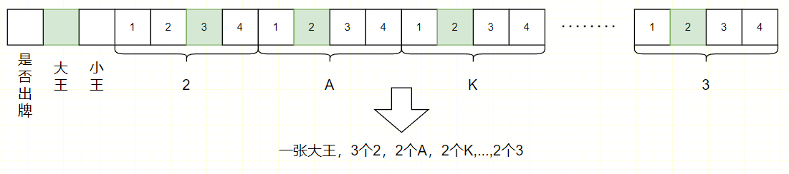
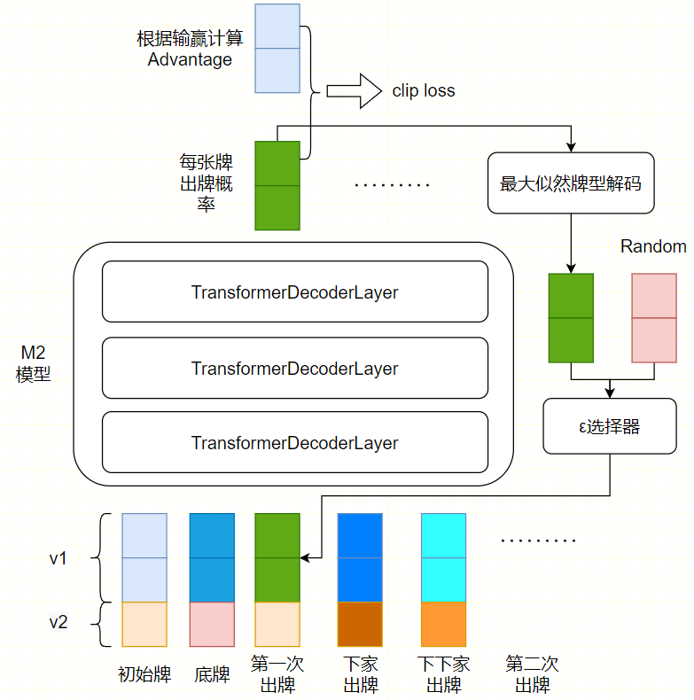
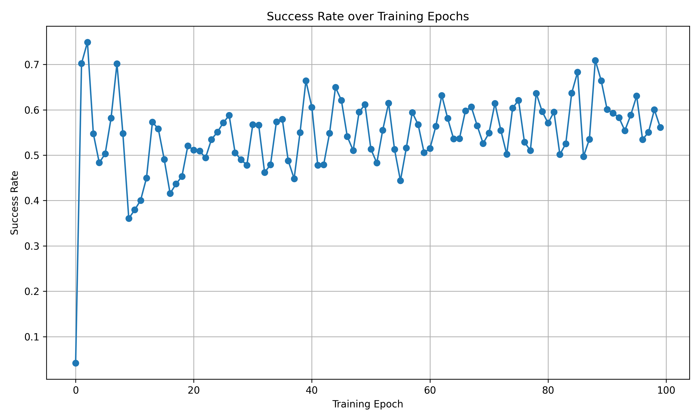

# 强化学习斗地主

## 方法总览

### 牌型表示(v1)



### 出牌身份表示(v2)


### 斗地主出牌模型（douformer）



## 测试结果

### 运行命令
```bash
python src/main.py
```

### 结果

使用两个随机出牌的agent作为douformer的对手，douformer（地主）赢牌率随训练轮次的变化如下：



日志文件为：`logs/train-1.log`

如果地主也随机出牌，赢牌率约为0.34
