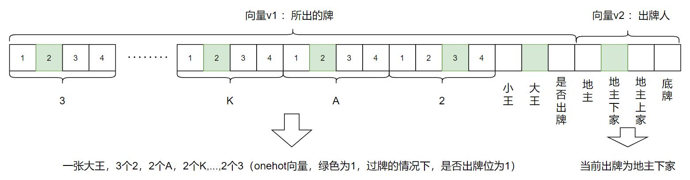
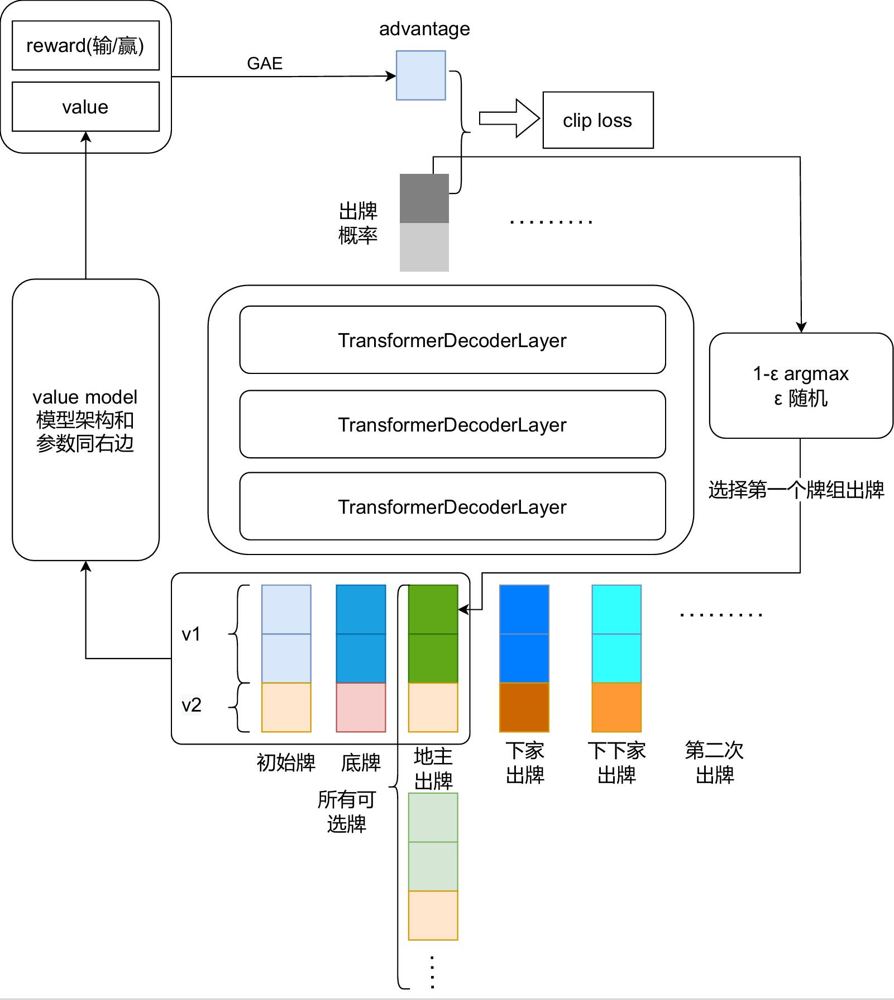
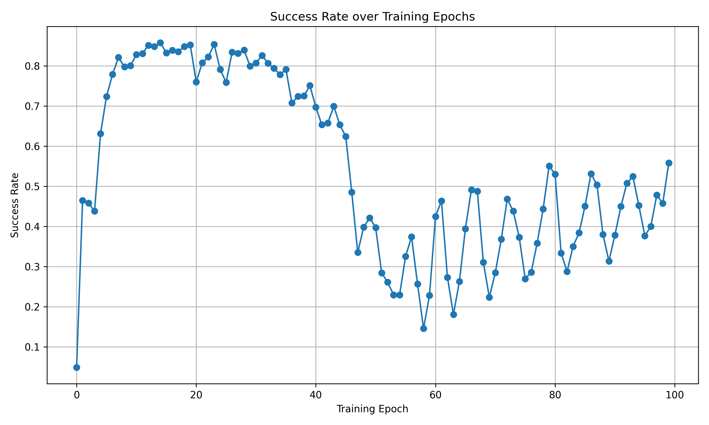
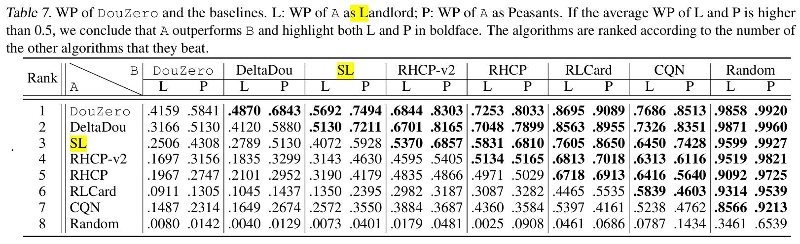

# 强化学习斗地主

## 动机

探究Transformer序列建模方法在斗地主上的性能，期望打造一个最强斗地主AI模型

## 方法总览

### 状态表示



### 斗地主出牌模型（douformer）



## 测试结果

### 参数设置
| 超参数        | 值         |
|---------------|------------|
| 学习率        | 1e-4       |
| 批量大小      | 512        |
| buffer_size  | 2048 |
| 随机采样概率 | 0.03 |
| ppo_step | 4 |
| roll_num | 2048 |
| max_traj_len | 90 |

### 训练结果

```bash
# commit—_id https://github.com/loxs123/doudizhu-ai/tree/01da94d8692ba8a8929c42c3c49834137dab008a
python src/train.py --max_traj_len 90
```

使用两个随机出牌的agent作为douformer的对手，douformer（地主）赢牌率随训练轮次的变化如下：


日志文件为：`logs/exp1.log`

*先前代码的代码实现有误，上面是修正bug(去掉开局过牌的两次补位)并加入ε探索*

改进：完善状态表示，把其余玩家剩余牌数，自己执行动作后的手牌，以及其余两位玩家的合计剩余牌也加入到状态表示中，douformer（地主）赢牌率随训练轮次的变化如下，大约提升10%胜率：



日志文件为：`logs/exp2.log`

### 对比模型


### 下一步计划

借鉴大语言模型训练的思想，先让他学习baseline中的agent，然后再用强化学习激发性能。