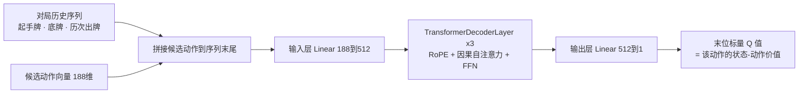
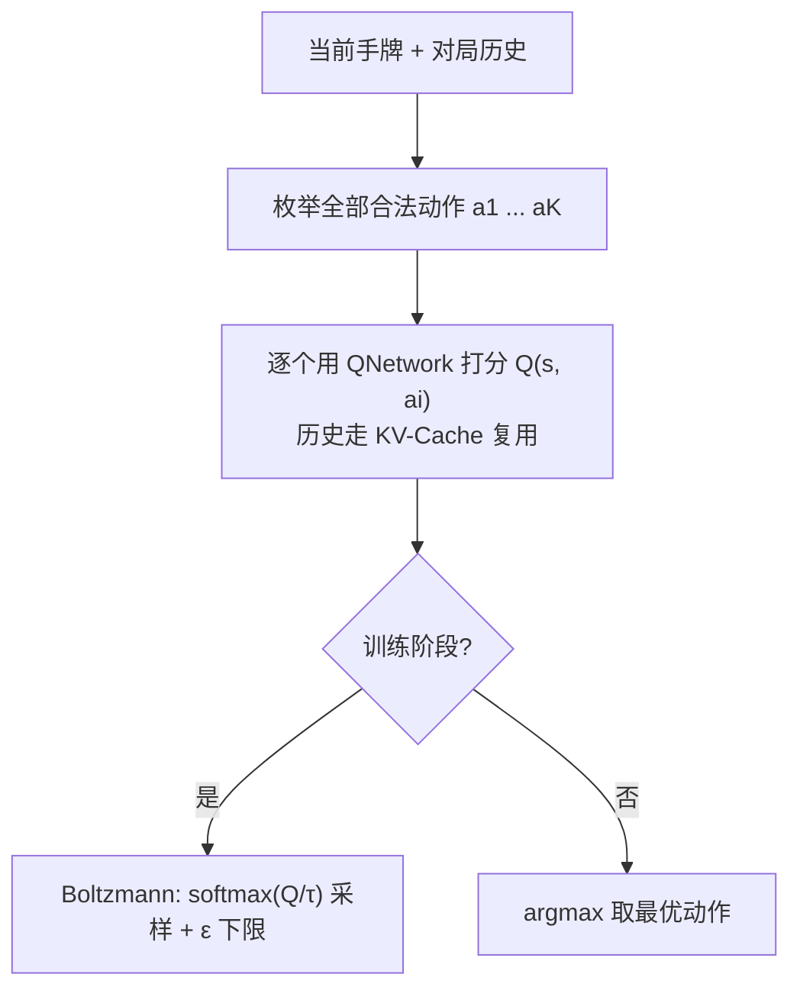
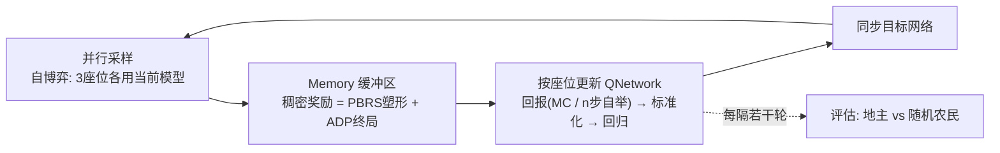

# 强化学习斗地主

## 动机

探究 Transformer 序列建模方法在斗地主上的性能，期望打造一个最强斗地主 AI 模型。

## 方法总览

整体是一个 **基于价值的深度蒙特卡洛(Deep Monte-Carlo, DMC)** 方案：用一个 Transformer 解码器把"对局历史 + 候选动作"编码成该动作的 **Q 值**，出牌时对所有合法动作打分取最优；训练时把每个(状态,动作)回归到其蒙特卡洛回报。不依赖动作概率分布，因此天然适配斗地主"合法动作集合大小不固定"的特点。

### 状态表示

每一步用一个 `EMBED_SIZE = 59 + 21 + 54 + 54 = 188` 维向量表示：

| 区段 | 维度 | 含义 |
|------|------|------|
| `[0:59]`   | 59 | 当前出的牌(54 维计数编码 + 不出标记 + 出牌身份标记: 玩家0/1/2/底牌) |
| `[59:80]`  | 21 | 出牌者剩余手牌数的 one-hot |
| `[80:134]` | 54 | 自己出牌后剩余手牌 |
| `[134:188]`| 54 | 其余两位玩家合计剩余牌 |

每局序列以两个特殊 token 开头：自己的起手牌、底牌；其后每个 token 是一手出牌。

### 出牌模型 douformer（QNetwork）

- 输入层 `Linear(188 → 512)`
- 3 层 `TransformerDecoderLayer`(`d_model=512, nhead=8, ffn=2048`，**RoPE 旋转位置编码**，因果掩码)
- 输出层 `Linear(512 → 1)`，对每个序列位输出一个标量 **Q 值**


```mermaid
flowchart LR
    H["对局历史序列<br/>起手牌 · 底牌 · 历次出牌"] --> CAT["拼接候选动作到序列末尾"]
    A["候选动作向量 188维"] --> CAT
    CAT --> IN["输入层 Linear 188到512"]
    IN --> TL["TransformerDecoderLayer x3<br/>RoPE + 因果自注意力 + FFN"]
    TL --> OUT["输出层 Linear 512到1"]
    OUT --> Q["末位标量 Q 值<br/>= 该动作的状态-动作价值"]
```

出牌时：把每个合法候选动作分别拼到历史序列末尾，读取最后一位的 Q 值；历史部分用 **KV-Cache** 复用，避免重复前向。


```mermaid
flowchart TB
    S["当前手牌 + 对局历史"] --> LEGAL["枚举全部合法动作 a1 ... aK"]
    LEGAL --> SCORE["逐个用 QNetwork 打分 Q(s, ai)<br/>历史走 KV-Cache 复用"]
    SCORE --> SEL{训练阶段?}
    SEL -->|是| BOLT["Boltzmann: softmax(Q/τ) 采样 + ε 下限"]
    SEL -->|否| ARG["argmax 取最优动作"]
```

### 训练框架：自博弈

- **自博弈(selfplay)**：地主 + 两个农民三个座位各用一个独立可训练模型，每个 epoch 一起采样、一起更新；也支持 `--mode vs_random` 退回"仅地主训练、农民随机"。
- **并行采样**：多进程 rollout(`--num_workers`)，轨迹存入循环缓冲区 `Memory`，按座位 `agent_id` 分别更新。
- **定期评估**：每隔 `--eval_interval` 个 epoch，用当前地主模型对阵两个随机农民跑 `--eval_num` 局，得到不受自博弈对手强弱影响的"绝对棋力"指标。


```mermaid
flowchart LR
    SP["并行采样<br/>自博弈: 3座位各用当前模型"] --> MEM["Memory 缓冲区<br/>稠密奖励 = PBRS塑形 + ADP终局"]
    MEM --> UPD["按座位更新 QNetwork<br/>回报(MC / n步自举) → 标准化 → 回归"]
    UPD --> SYNC["同步目标网络"]
    SYNC --> SP
    UPD -.每隔若干轮.-> EVAL["评估: 地主 vs 随机农民"]
```

### 奖励与信用分配：四个支柱

为缓解"奖励稀疏、长程信用分配难、炸弹/高牌价值学不到"的问题，引入四项改进(均可通过命令行开关)：

1. **ADP 倍率奖励 + 回报标准化**(`utils.count_multiplier`, `agent.update`)
   终局奖励 = `±1 × 2^(炸弹+火箭次数)`，春天/反春天再 ×2(`--mult_cap` 封顶)；让"用炸弹果断收尾的赢"价值更高。因奖励量级不一，对回报做掩码标准化防梯度尺度失衡。`--reward_multiplier 0` 可退回纯胜负(WP)。

2. **PBRS 势函数塑形**(`utils.hand_potential`, `memory.add`)
   每个自己的决策位加稠密塑形奖励 `F = γ·Φ(出牌后手牌) − Φ(出牌前手牌)`。势 Φ 综合出牌进度、炸弹/火箭、2 与王、碎牌惩罚。基于势差的形式 **理论上保证不改变最优策略**(Ng et al. 1999)，只加速学习并改善"浪费高牌当垫子"等问题。

3. **Boltzmann 探索**(`agent.action`, `train.py`)
   训练时按 `softmax(Q/τ)` 采样(混入 ε 均匀下限)，温度 τ 随 epoch 从 `--temperature` 线性退火到 `--temperature_min`。让炸弹这类稀有但高价值的动作有机会被试到，打破"从没试过炸弹→永远学不到其价值"的恶性循环。

4. **目标网络 + n 步回报**(`agent.QNetwork` target, `agent.compute_returns`)
   支持用滞后同步的目标网络做 n 步自举以降方差。默认 `--n_step 0`(纯蒙特卡洛)；训练震荡时可设 `--n_step 3` 等。

## 使用方法

### 训练

```bash
# 默认: 自博弈 + ADP倍率 + PBRS + Boltzmann探索 (n步自举默认关闭)
python src/train.py --max_traj_len 90

# 退回纯胜负奖励做对照
python src/train.py --max_traj_len 90 --reward_multiplier 0

# 开启 n 步自举
python src/train.py --max_traj_len 90 --n_step 3
```

模型每 50 个 epoch 存档为 `agent{0,1,2}_{epoch}.pth`。

### 评估

```bash
# 加载地主模型, 确定性对阵随机农民, 给出胜率+置信区间, 并打印/落盘所有败局
python src/eval_model.py --model agent0_100.pth --games 4096 --num_workers 8
```

输出含 **Wilson 95% 置信区间**(局数越多越准)，以及败局的"硬牌诊断"(无炸/无火/弱牌占比，用于判断是否逼近对随机农民的胜率上限)，全部败局连同起手/底牌/出牌过程写入 `logs/eval_losses.txt`。

### 在线训练看板（离线、零依赖）

```bash
python tools/dashboard.py            # 读 logs/metrics.jsonl, 浏览器开 http://127.0.0.1:8000
```

纯 Python 标准库 HTTP 服务 + 原生 canvas 图表，无任何 CDN/第三方依赖，断网可用，与训练进程解耦；实时刷新胜率(rollout/eval)、各座位 Q-Loss、解释方差、Q 均值曲线及最近 epoch 表格。

## 主要超参数

| 参数 | 默认值 | 说明 |
|------|--------|------|
| `lr` | 1e-4 | 学习率 |
| `batch_size` | 512 | 训练批量 |
| `buffer_size` | 2048 | 经验缓冲区大小 |
| `roll_num` | 2048 | 每 epoch 采样对局数 |
| `ppo_update_step` | 4 | 每 epoch 的梯度步数 |
| `max_traj_len` | 90 | 单局最大手数 |
| `gae_gamma` | 0.99 | 折扣因子(同时用于 PBRS 与回报) |
| `sample_eps` | 0.03 | 探索的均匀下限概率 |
| `temperature` / `temperature_min` | 1.0 / 0.1 | Boltzmann 起始/退火终点温度 |
| `reward_multiplier` / `mult_cap` | 1 / 4 | ADP 倍率开关 / 2 的幂次上限 |
| `use_pbrs` | 1 | PBRS 势函数塑形开关 |
| `normalize_returns` | 1 | 回报掩码标准化开关 |
| `n_step` | 0 | 0=蒙特卡洛; >0=n 步自举 |
| `mode` | selfplay | `selfplay` / `vs_random` |
| `num_workers` | 8 | 并行采样进程数 |

## 代码结构

```
src/
  env.py         斗地主环境(发牌/出牌/合法性/对局循环)
  utils.py       牌型判定、合法出牌枚举、状态编码、势函数与倍率
  agent.py       QNetwork(Transformer)、Agent(选择/更新)、compute_returns
  memory.py      经验缓冲区: 稠密逐步奖励(PBRS + 终局)与采样
  train.py       自博弈训练主循环、并行采样、评估、日志/指标输出
  eval_model.py  模型评估: 胜率+置信区间, 败局诊断与落盘
tools/
  dashboard.py   离线网页训练看板
```

## 下一步计划

[1] 用 `eval_model.py` 量化四支柱改进对"能赢却输"的败局的修复效果(可加"地主终局仍持炸弹比例"指标)。

[2] 引入对手池 / league(对手从历史 checkpoint 采样)进一步稳定自博弈、提升鲁棒性。

[3] 推理时浅层前瞻(对候选动作展开数步再评估)，针对性修补残局收尾失误。
